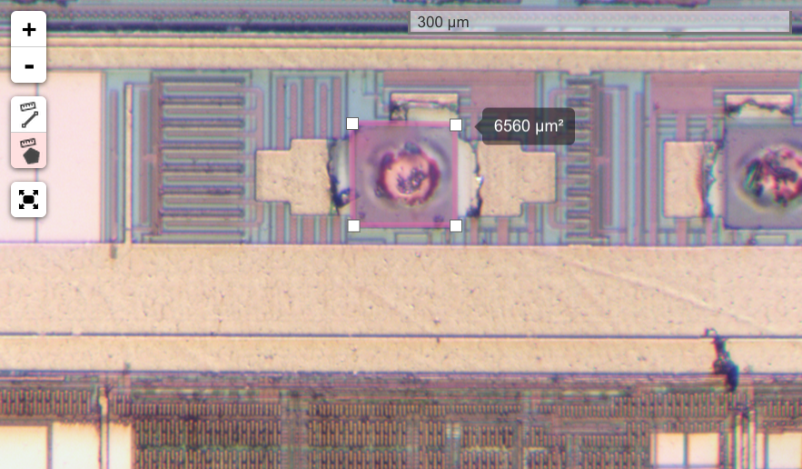

Leaflet.Nanomeasure
===================

Leaflet.Nanomeasure is a sub-millimeter measurement tool for [Leaflet](http://leaflet.com). It allows to select a path or outline and displays the length or area in square nanometers, micrometers or millimeters.

Screenshot
----------



Usage
-----

Include the script:

``` html
<script type="text/javascript" src="Leaflet.Nanomeasure/Control.Nanomeasure.js"></script>
<link type="text/css" rel="stylesheet" href="Leaflet.Nanomeasure/Control.Nanomeasure.css">
```

Add the control to the map:

``` javascript
L.control.nanomeasure({
  nanometersPerPixel: scale,
}).addTo(map);
```

Options
-------

| Option               | Type      | Default            | Description |
| -------------------- | --------- | --------------     | ----------- |
| `nanometersPerPixel` | `Number`  | `1000`             | The ratio between pixels at known zoom and nanometers. |
| `ratioAtZoom`        | `Number`  | `map.getMaxZoom()` | The zoom level used for translating pixels to distances. |
| `position`           | `String`  | `'bottomleft'`     | The position of the control (one of the map corners). See [control positions](http://leafletjs.com/reference.html#control-positions). |

License
-------

[MIT license](LICENSE.txt)
